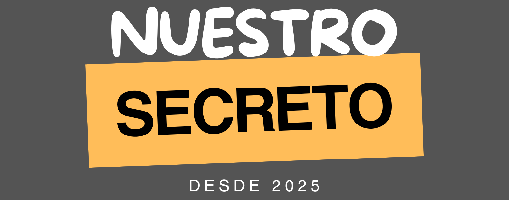

# `✨ Nuestro Secreto ✨`

**Nuestro Secreto** es una aplicación web inspirada en la nostalgia de TuSecreto.com, que cerró sus puertas en 2025. La app busca revivir las risas, la curiosidad y las historias anónimas de nuestra juventud de manera segura y divertida.  

## 🎯 Objetivo
Crear un espacio digital donde los usuarios puedan compartir secretos o confesiones de manera anónima (opcional), recordando la diversión y curiosidad de épocas pasadas, y a la vez ofrecer una experiencia web moderna y segura.  

## 💡 Características
- Publicación de secretos.  
- Interfaz amigable.  
- Seguridad y privacidad de los usuarios garantizada.  
- Plataforma responsiva, adaptable a móviles y desktops.  
- Inspiración en la experiencia de TuSecreto.com.  

## ⚙️ Tecnologías
- **Frontend:** HTML5, CSS3, JavaScript (React.js)  
- **Backend:** Node.js, Express  
- **Base de datos:** Firebase  
- **Autenticación:** Opcional, con énfasis en anonimato  
- **Despliegue:** Vercel

## 📝 Uso
- Los usuarios pueden leer secretos publicados por otros, compartirlos y darle like.
- Se pueden publicar nuevos secretos de forma anónima, pero es requisito fundamental ser mayor de 18 años. Es importante desatcar que para ver publicado tu secreto el mismo pasa por un proceso de moderación y llegar a un total de 50 votos. 
- Se fomenta la interacción divertida, sin riesgos ni exposición de datos personales.

## 🔒 Privacidad
- Los secretos se almacenan de manera segura y no contienen datos identificables.
- No se comparte información de los usuarios.

## 💭 Inspiración
El proyecto surge como un homenaje a los recuerdos de la niñez y adolescencia, a esas risas que generaban las confesiones anónimas, y demuestra que la tecnología puede ser un vehículo de nostalgia y diversión.

## 📌 Contribuciones
Se reciben pull requests con ideas para mejorar la app o su seguridad.
Para bugs, por favor abrir un issue detallando el problema.

## 🏷️Etiquetas

#DesarrolloWeb #NostalgiaDigital #NuestroSecreto #ProyectosPersonales #InnovaciónConSentido
______________________________________________________________________________________________________
### `ÚLTIMA ACTUALIZACIÓN DEL PROYECTO 06/09/2025`